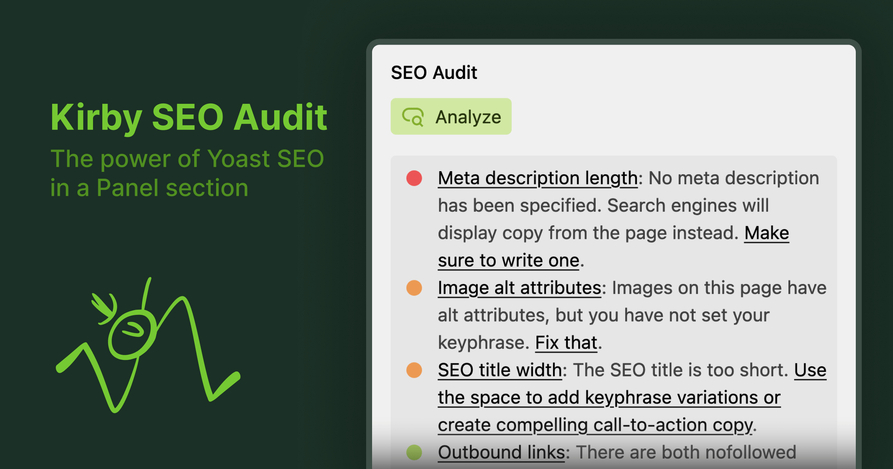

# Kirby SEO Audit

Kirby SEO Audit is a plugin for [Kirby CMS](https://getkirby.com) that analyzes your pages and provides actionable insights to improve your website's search engine optimization (SEO). It works directly in the Panel and is compatible with every Kirby website.

## Getting Started

To get started, please refer to the [documentation](https://kirbyseo.com/docs/get-started) for guidance on installation, configuration, and usage.

Here are some quick links:

- [Installation](https://kirbyseo.com/docs/get-started)
- [Global Configuration](https://kirbyseo.com/docs/configuration/global)
- [Section Configuration](https://kirbyseo.com/docs/configuration/section)

## Licensing

Kirby SEO Audit is a commercial plugin that requires a license. You can install and test the plugin locally without a license. However, production environments require a valid license. You can purchase a license from the [Kirby SEO Audit Website](https://kirbyseo.com/buy).

## Support and Questions

We are committed to support you if you have any questions or issues with Kirby SEO Audit. There are several ways to get support:

- **GitHub Discussions**: Join the community and engage in discussions on our [GitHub Discussions page](https://github.com/kirby-tools/community/discussions).
- **Email Support**: You can ask questions and seek assistance by emailing us at [hello@kirbyseo.com](mailto:hello@kirbyseo.com). Please use the GitHub discussions if you have a general question or comment about Kirby SEO Audit.
- **GitHub Issues**: For reporting bugs or requesting new features, please use the [GitHub Issues page](https://github.com/kirby-tools/community/issues).

We encourage you to use the resources above to connect with us and other users of Kirby SEO Audit.

For the sake of reproducible bug reports, please include the following information in your bug reports:

- Kirby & Kirby SEO Audit version
- Browser environment (name, version, operating system)
- Global and section configuration (without any sensitive information)
- Steps to reproduce the bug (if no reproduction is provided)
- Screenshots or screen recordings if applicable

## Feedback

We value your feedback and ideas for improving Kirby SEO Audit. If you have any suggestions, please feel free to reach out to us via email or preferably by creating a new discussion on our [GitHub Discussions page](https://github.com/kirby-tools/community/discussions).

## License

[Kirby SEO Audit Plugin License Agreement](./LICENSE.md) License © 2024-PRESENT [Johann Schopplich](https://github.com/johannschopplich)
