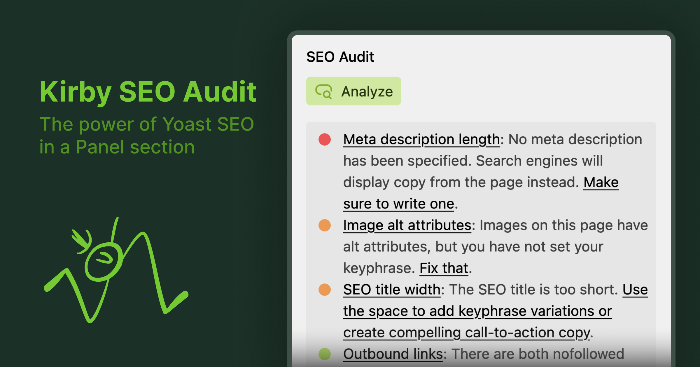

# Kirby SEO Audit

The Kirby SEO Audit plugin provides comprehensive SEO analysis directly within the Kirby Panel. It helps you, your clients, and editors optimize content for search engines with real-time analysis and actionable recommendations. Built on the Yoast SEO v3 engine, the plugin lets you improve your website's SEO the way millions of Yoast WordPress users do.

## Features

- 🎛️ **One-Click Analysis**: Run SEO audits with a single click from the view button or section.
- 🔍 **28 SEO & Readability Assessments**: Comprehensive analysis powered by Yoast SEO v3 with improved performance and updated metrics.
- 🔒 **Local Analysis**: All assessments run locally in your browser – no external web services needed.
- 📊 **Categorized Results**: Results organized into Good, OK, Bad, and Feedback categories for clear prioritization.
- 🎯 **Keyphrase Analysis**: Advanced keyword density, distribution, and optimization insights.
- 🖼️ **Image SEO**: Automated checks for alt attributes, image optimization, and keyphrase usage.
- 🌐 **Multi-language Support**: Language-specific assessments and region-aware SEO recommendations.
- 🔧 **Flexible Configuration**: Customizable assessments, content selectors, and per-blueprint settings.

## Getting Started

To get started, please refer to the [documentation](https://kirby.tools/docs/seo-audit/get-started) for guidance on installation, configuration, and usage.

Here are some quick links:

- [Installation](https://kirby.tools/docs/seo-audit/get-started)
- [Global Configuration](https://kirby.tools/docs/seo-audit/configuration/global)
- [Section Configuration](https://kirby.tools/docs/seo-audit/configuration/section)

## Licensing

Kirby SEO Audit is a commercial plugin that requires a license. You can install and test the plugin locally without a license. However, production environments require a valid license. You can purchase a license from the [Kirby SEO Audit Website](https://kirby.tools/seo-audit/buy).

## Support and Questions

We are committed to support you if you have any questions or issues with Kirby SEO Audit. There are several ways to get support:

- **GitHub Discussions**: Join the community and engage in discussions on our [GitHub Discussions page](https://github.com/kirby-tools/community/discussions).
- **Email Support**: You can ask questions and seek assistance by emailing us at [hello@kirby.tools](mailto:hello@kirby.tools). Please use the GitHub discussions if you have a general question or comment about Kirby SEO Audit.
- **GitHub Issues**: For reporting bugs or requesting new features, please use the [GitHub Issues page](https://github.com/kirby-tools/community/issues).

We encourage you to use the resources above to connect with us and other users of Kirby SEO Audit.

For the sake of reproducible bug reports, please include the following information in your bug reports:

- Kirby & Kirby SEO Audit version
- Browser environment (name, version, operating system)
- Global and section configuration (without any sensitive information)
- Steps to reproduce the bug (if no reproduction is provided)
- Screenshots or screen recordings if applicable

## Feedback

We value your feedback and ideas for improving Kirby SEO Audit. If you have any suggestions, please feel free to reach out to us via email or preferably by creating a new discussion on our [GitHub Discussions page](https://github.com/kirby-tools/community/discussions).

## License

[Kirby Tools License](./LICENSE.md) License © 2024-PRESENT [Johann Schopplich](https://github.com/johannschopplich)
