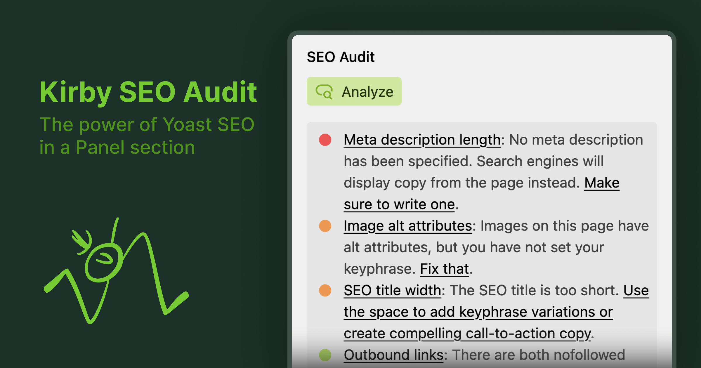

# Kirby SEO Audit

Kirby SEO Audit is a plugin for [Kirby CMS](https://getkirby.com) that brings the Yoast SEO v3 analysis engine – the one millions of WordPress users rely on – into the Panel. The analysis runs in the editor's browser; no external services, no data sent to third parties.

## Features

- 🎛️ **View Button & Section**: Run the audit from the page header or inline in a section.
- 🔍 **SEO & Readability Assessments**: Powered by the Yoast SEO v3 engine, plus checks of our own.
- 📊 **SEO & Readability Scores**: Every check graded into Good, OK, Needs improvement, and Feedback.
- 🎯 **Keyphrase Field**: Nine more checks against the page's focus keyword.
- 🌐 **Language-Specific Features**: 22 rule sets, picked from the page's `lang` attribute.
- 🔒 **Local Analysis**: Runs in the editor's browser, no external service involved.

## Getting Started

To get started, please refer to the [documentation](https://kirby.tools/docs/seo-audit/getting-started/installation) for guidance on installation, configuration, and usage.

Here are some quick links:

- [Installation](https://kirby.tools/docs/seo-audit/getting-started/installation)
- [Global Configuration](https://kirby.tools/docs/seo-audit/configuration/global)
- [View Button & Section Configuration](https://kirby.tools/docs/seo-audit/configuration/local)

## Licensing

Kirby SEO Audit is a commercial plugin that requires a license. You can install and test the plugin locally without a license. However, production environments require a valid license. You can purchase a license from the [Kirby SEO Audit Website](https://kirby.tools/seo-audit/buy).

## Support and Questions

We are committed to support you if you have any questions or issues with Kirby SEO Audit. There are several ways to get support:

- **GitHub Discussions**: Join the community and engage in discussions on our [GitHub Discussions page](https://github.com/kirby-tools/community/discussions).
- **Email Support**: You can ask questions and seek assistance by emailing us at [hello@kirby.tools](mailto:hello@kirby.tools). Please use the GitHub discussions if you have a general question or comment about Kirby SEO Audit.
- **GitHub Issues**: For reporting bugs or requesting new features, please use the [GitHub Issues page](https://github.com/kirby-tools/community/issues).

We encourage you to use the resources above to connect with us and other users of Kirby SEO Audit.

For the sake of reproducible bug reports, please include the following information in your bug reports:

- Kirby & Kirby SEO Audit version
- Browser environment (name, version, operating system)
- Global and section configuration (without any sensitive information)
- Steps to reproduce the bug (if no reproduction is provided)
- Screenshots or screen recordings if applicable

## Feedback

We value your feedback and ideas for improving Kirby SEO Audit. If you have any suggestions, please feel free to reach out to us via email or preferably by creating a new discussion on our [GitHub Discussions page](https://github.com/kirby-tools/community/discussions).

## License

[Kirby Tools License](./LICENSE.md) License © 2024-PRESENT [Johann Schopplich](https://github.com/johannschopplich)
